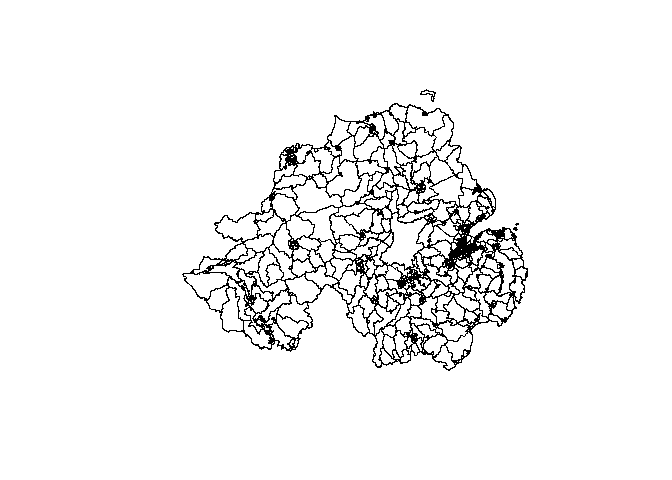

# Open access data

To get open access OD data for Northern Ireland, go to
https://wicid.ukdataservice.ac.uk/cider/wicid/downloads.php, click on
Start a new session - no username or password required, then download
the 2021_OD_NI_OPEN link.

``` r
zones_sdz = sf::read_sf("data/geography-sdz2021-geojson/SDZ2021.geojson")
zones_sdz = zones_sdz |>
  rename_with(~ tolower(gsub(" ", "_", .x)))
od_ni_open = read_csv("data/2021_OD_NI_OPEN_V1/Census 2021 origin-destination place of work tables (UK)/ODWP01NI-UK-SDZ.csv")
```

    Rows: 116200 Columns: 7
    ── Column specification ────────────────────────────────────────────────────────
    Delimiter: ","
    chr (5): Area of residence code, Area of residence label, Workplace area cod...
    dbl (2): PLACE_OF_WORK_IND_code, Count

    ℹ Use `spec()` to retrieve the full column specification for this data.
    ℹ Specify the column types or set `show_col_types = FALSE` to quiet this message.

``` r
od_ni_open = od_ni_open |>
  mutate(across(where(is.character), as.factor)) |>
  rename_with(~ tolower(gsub(" ", "_", .x)))

od_ni_open |>
  slice(1:2) |>
  knitr::kable()
```

| area_of_residence_code | area_of_residence_label | workplace_area_code | workplace_area_label | place_of_work_ind_code | place_of_work_ind_label | count |
|:---|:---|:---|:---|---:|:---|---:|
| N21000001 | Dunsilly_A | 999999999 | Workplace outside the UK | 3 | Working outside UK | 13 |
| N21000001 | Dunsilly_A | E02001096 | Manchester 052 | 4 | Working inside UK | 1 |

``` r
dplyr::glimpse(od_ni_open)
```

    Rows: 116,200
    Columns: 7
    $ area_of_residence_code  <fct> N21000001, N21000001, N21000001, N21000001, N2…
    $ area_of_residence_label <fct> Dunsilly_A, Dunsilly_A, Dunsilly_A, Dunsilly_A…
    $ workplace_area_code     <fct> 999999999, E02001096, E02003710, E02003717, E0…
    $ workplace_area_label    <fct> "Workplace outside the UK", "Manchester 052", …
    $ place_of_work_ind_code  <dbl> 3, 4, 4, 4, 4, 4, 4, 4, 4, 4, 2, 1, 2, 4, 4, 4…
    $ place_of_work_ind_label <fct> Working outside UK, Working inside UK, Working…
    $ count                   <dbl> 13, 1, 1, 1, 1, 1, 1, 1, 1, 1, 1, 336, 219, 51…

``` r
# summary(od_ni_open)
# #  area_of_residence_code        area_of_residence_label workplace_area_code
# #  N21000557:   259       Castlereagh_South_E:   259     N21000251:   827       
# #  N21000530:   245       Lisburn_South_E    :   245     999999999:   821       
# #  N21000550:   244       Downshire_East_E   :   244     N21000192:   808       
# #  N21000546:   240       Downshire_East_A   :   240     N21000252:   727       
# #  N21000024:   238       Ballyclare_F       :   238     N21000335:   724       
# #  N21000517:   236       Comber_G           :   236     N21000198:   694       
# #  (Other)  :114738       (Other)            :114738     (Other)  :111599       
# #                workplace_area_label place_of_work_ind_code
# #  Botanic_A               :   827    Min.   :1.000
# #  Workplace outside the UK:   821    1st Qu.:4.000
# #  Castle_Q                :   808    Median :4.000
# #  Botanic_B               :   727    Mean   :3.947
# #  Court_X                 :   724    3rd Qu.:4.000
# #  Titanic_B               :   694    Max.   :4.000
# #  (Other)                 :111599
# #                 place_of_work_ind_label     count
# #  Mainly work at or from home:   850     Min.   :  1.000
# #  No fixed place             :  1414     1st Qu.:  1.000
# #  Working inside UK          :113115     Median :  2.000
# #  Working outside UK         :   821     Mean   :  7.005
# #                                         3rd Qu.:  4.000
# #                                         Max.   :725.000

# Filter out all destinations keeping only those within Northern Ireland
od_ni_open_filtered = od_ni_open |>
  filter(workplace_area_code %in% zones_sdz$sdz2021_cd)
nrow(od_ni_open_filtered) # 110356 vs 110356 
```

    [1] 110356

``` r
summary(od_ni_open_filtered)
```

     area_of_residence_code        area_of_residence_label workplace_area_code
     N21000557:   247       Castlereagh_South_E:   247     N21000251:   827   
     N21000530:   235       Lisburn_South_E    :   235     N21000192:   808   
     N21000546:   231       Downshire_East_A   :   231     N21000252:   727   
     N21000024:   230       Ballyclare_F       :   230     N21000335:   724   
     N21000777:   227       Comber_G           :   227     N21000198:   694   
     N21000550:   225       Downshire_East_E   :   225     N21000256:   673   
     (Other)  :108961       (Other)            :108961     (Other)  :105903   
     workplace_area_label place_of_work_ind_code
     Botanic_A:   827     Min.   :1.000         
     Castle_Q :   808     1st Qu.:4.000         
     Botanic_B:   727     Median :4.000         
     Court_X  :   724     Mean   :3.961         
     Titanic_B:   694     3rd Qu.:4.000         
     Botanic_F:   673     Max.   :4.000         
     (Other)  :105903                           
                    place_of_work_ind_label     count        
     Mainly work at or from home:   850     Min.   :  1.000  
     No fixed place             :   850     1st Qu.:  1.000  
     Working inside UK          :108656     Median :  2.000  
     Working outside UK         :     0     Mean   :  7.211  
                                            3rd Qu.:  4.000  
                                            Max.   :725.000  
                                                             

``` r
# Upload clean od data as csv:
write_csv(od_ni_open_filtered, "od_ni_open_filtered.csv")
# And save geo data as gpkg:
sf::write_sf(zones_sdz, "zones_sdz.gpkg", delete_dsn = TRUE)
system("gh release upload v1.0.0 zones_sdz.gpkg od_ni_open_filtered.csv")
```

    [1] 1

``` r
plot(zones_sdz$geometry)
```


